<h1 align="center"> Breakout game</h1>
<h3 align="center"> Jogo inspirado no clássico Breakout, desenvolvido para o kit de desenvolvimento DE1-SoC utilizando linguagem C </h3>

 

 
<h2> Sobre o Projeto</h2>

Atualmente, a Apple é uma das maiores empresas de desenvolvimento e inovação tecnológica, com suas produções conhecidas de dispositivos móveis e computadores pessoais. Dois dos seus principais fundadores foram Steve Jobs e Wozniak, um inventor e um engenheiro que moldaram uma geração de jogos eletrônicos na década de 70 com a criação do jogo de arcade Breakout. 

Este projeto tem o intuito de desenvolver um jogo inspirado no Breakout. É utilizada a placa FPGA DE1-SoC para executar o sistema e disponibilizar a interface de controle ao usuário. Um acelerômetro imbutido na placa permite captar a movimentação pretendida pelo usuário. Botões são utilizados para executar comandos no jogo. E os dados de imagem são transmitidos por um cabo VGA para um monitor CRT, sendo ele, o dispositivo que fará a exibição das telas ao usuário. 

Os requisitos para elaboração do sistema são apresentados a seguir:

* O código carregado na DE1-SoC deve ser feito em linguagem C;
* Um acelerômetro deve captar a movimentação feita na placa para alterar a posição da barra que irá colidir com a bola;
* Os botões devem ser utilizados para executar comandos no jogo;
* Os dados de imagem devem ser transmitidos de um cabo VGA para um monitor CRT;

<h2>  Equipe:  </h2>
<uL> 
  <li><a href="https://github.com/Samara-Ferreira">Samara dos Santos Ferreira</a></li>
  <li><a href="https://github.com/Silviozv">Silvio Azevedo de Oliveira</a></li>
  <li><a href="https://github.com/SivalLeao">Sival Leão de Jesus</a></li>
  <li><a href="https://github.com/TAlmeida003">Thiago Neri dos Santos Almeida</a></li>
</ul>

<h1 align="center"> Sumário </h1>

	<ul>
        <li><a href="#equipamentos">  Descrição dos Equipamentos e Software Utilizados</a></li>
        <li><a href="#arq_CPU">  Arquitetura da placa DE1-SoC</a></li>
        <li><a href="#Perifericos-utilizados"> Periféricos da placa DE1-SoC utilizados </a></li>
        <li><a href="#Drives"> Drives de Dispositivos de Entrada e Saída (I/O) </a></li>
        <li><a href="#Inteface-Grafica"> Interface do Usuário </a></li>
        <li><a href="#Regras-de-jogo"> Dinâmica e Regras de Jogo </a></li>
        <li><a href="#Algoritmos"> Algoritmos de Jogo </a></li>
        <li><a href="#solucao-geral"> Solução Geral do projeto </a></li>
        <li><a href="#testes"> Testes Realizados </a></li>
        <li><a href="#conclusao"> Conclusão </a></li>
        <li><a href="#execucaoProjeto"> Execução do Projeto </a></li>
        <li><a href="#referencias"> Referências </a></li>
	</ul>	

 
<h2> Descrição dos Equipamentos e Software Utilizados</h2>

 

 
<h2> Arquitetura da placa DE1-SoC</h2>

Nesta seção, será explorado a arquitetura da placa DE1-SoC, incluindo o processador ARM Cortex-A9, a estrutura de registros, o mapeamento de dispositivos de entrada/saída na memória, a memória utilizada, a comunicação entre o processador e o FPGA, e o processo de compilação nativa na placa

<h3>Visão Geral dos Recursos do Processador ARM Cortex-A9 </h3>

O processador ARM Cortex-A9 utiliza uma arquitetura de conjunto de instruções reduzido (RISC), onde as operações aritméticas e lógicas são realizadas nos registradores de uso geral. Os dados são movidos entre memória e registradores através de instruções Load e Store, com um comprimento de palavra de 32 bits e endereços de bytes em um estilo little-endian.

<h3>Estrutura do Registro</h3>

O processador ARM Cortex-A9 possui 15 registros de uso geral (R0 a R14), um contador de programa (R15) e um registro de status de programa atual, CPSR, todos com 32 bits. Dois registros são tratados de maneira especial: R13 é o Stack Pointer e R14 é um registro de link na ligação de sub-rotina.

  

<strong>Registradores disponíveis e sua organização interna</strong>

<h3>Instruções e Conjunto Thumb</h3>

As instruções têm 32 bits e são armazenadas na memória alinhadas por palavras. O conjunto Thumb oferece uma versão menor com instruções de 16 bits, resultando em requisitos menores de memória, úteis em aplicativos incorporados.

<h3>Memória</h3>

O HPS inclui uma porta de memória que conecta o ARM MPCORE a uma memória DDR3 de 1 GB. Esta memória é normalmente utilizada como local de armazenamento de programas e dados pelos processadores ARM. A memória é organizada em 256M x 32 bits e pode ser acessada por meio de acessos de palavras (32 bits), meias palavras e bytes.

<h3>Mapeamento de Dispositivos de E/S</h3>

Os dispositivos de entrada/saída acessíveis pelo processador ARM são mapeados na memória e podem ser acessados como locais de memória, utilizando instruções Load e Store.

<h3>Interrupções de Hardware</h3>

As interrupções de hardware podem ser geradas por dispositivos de E/S, ativando as entradas de solicitação de interrupção do processador (IRQ ou FIQ). Quando ocorre uma interrupção, o processador entra no modo de exceção correspondente e salva o estado atual do programa. O endereço salvo no registrador de link deve ser decrementado em 4 antes de retornar ao programa interrompido. Isso pode ser feito manualmente ou usando um comando de subtração no código de exceção de interrupção.

<h3>Diagrama de Blocos do Sistema DE1-SoC</h3>

O sistema DE1-SoC é composto pelo Hard Processor System (HPS) e FPGA dentro do chip Cyclone V SoC. O HPS inclui um processador dual-core ARM Cortex-A9, uma porta de memória DDR3 e dispositivos periféricos. O FPGA implementa dois processadores Intel Nios II e várias portas periféricas.

  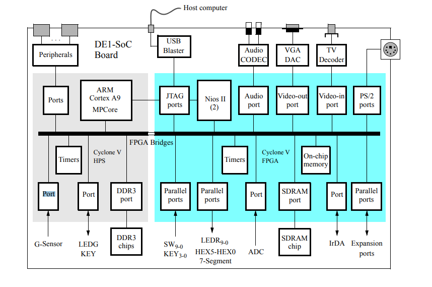

<strong>Diagrama da arquitetura da placa DE1-SoC</strong>

<h3>Comunicação entre Processador e FPGA via JTAG</h3>

A porta JTAG implementa um link de comunicação entre a placa DE1-SoC e seu computador host, permitindo a transferência de arquivos de programação FPGA para a placa DE1-SoC e o monitoramento por meio do programa Intel FPGA Monitor.

<h3>Compilação Nativa na Placa DE1-SoC</h3>

O processo de compilação nativa ocorre quando um programa é compilado em um sistema para rodar na mesma arquitetura do próprio sistema. Neste caso, vamos compilar nativamente um programa por meio da interface de linha de comando do Linux, usando sua cadeia de ferramentas de compilação integrada. O comando gcc invoca o GNU C Compiler, um compilador de código aberto amplamente usado para compilar programas Linux.

 
<h2> Periféricos da placa DE1-SoC utilizados</h2>

A seguir, serão feitas as descrições gerais dos periféricos utilizados da placa DE1-SoC e seus aspectos mais importantes. 

<h3>Porta de saída de vídeo</h3>

A placa possui uma porta de saída de vídeo com um controlador VGA, que pode ser conectado a um monitor do padrão VGA. A informações podem ser transmitidas de duas fontes: um buffer de pixels e um buffer de caracteres. O buffer de caracteres tem a função de especificar caracteres de texto que devem ser exibidos no monitor e, como não foi utilizado no sistema, ele não será focado nesse tópico. 

As imagens exibidas no monitor tiveram como fonte o buffer de pixels. Ele contém os dados de cor de cada pixel transmitido pelo controlador VGA. Esse controlador suporta uma resolução de 640 x 480, porém, o buffer de pixels só fornece uma resolução de imagem de 320 x 240, por isso, cada valor de pixel é duplicado nas duas dimensões. 

Cada pixel contém um conjunto de bits que são distribuídos entre as cores: vermelho, azul e verde. Uma imagem pode ser criada escrevendo os valores das cores no endereço do pixel especificado. O controlador do buffer de pixels lê os dados da memória e envia para o monitor VGA. 

Com o objetivo de conseguir modificar o buffer de pixels sem alterar a imagem transmitida, a placa utiliza um sistema de "double buffer". Nesse esquema, existem dois espaços de armazenamento dos dados dos pixels, um que é transmitido para a tela VGA, chamado de "front buffer", e outro que não está sendo transmitido, mas pode ser modificado, chamado de "back buffer". 

Cada vez que os dados dos pixels devem ser modificados, o usuário escreve no "back buffer" e quando quiser enviar esses dados para a tela VGA, é feita uma troca de buffers. Essa troca coloca o "back buffer" na frente e o "front buffer" atrás, assim, esse ciclo continua para se fazer o dinamismo das imagens exibidas. Porém, todos os pixels só são atualizados na tela com a frequência de 60 Hz, não podendo usar uma velocidade de troca de buffer superior a essa. 

<h3>Acelerômetro ADXL345</h3>

O acelerômetro ADXL345 é um leitor de aceleração em intervalos regulares nos três eixos. Sua escala pode ser calibrada, porém, o seu intervalo de leitura máximo está entre -16g a 16g, sendo g, o valor de 9.81 metros por segundo ao quadrado. 

Esse dispositivo está embutido na placa e sua comunicação é feita pelo protocolo, de comunicação serial, I2C. É feita a conexão do acelerômetro com o controlador dessa comunicação para poder ler os dados e configurar a transmissão.

Os movimentos feitos com a placa, ou sua posição em relação a direção da gravidade, retornam determinadas medidas de aceleração. Sua utilização consiste em ler esses dados de aceleração retornados dos três eixos: x, y e z.  

<h3>Botões</h3>

A placa disponibiliza quatro botões para utilização. Os dados de leitura dos botões são armazenados em um registrador de dados, com seus quatro bits menos significativos representando cada um dos botões. Quando um botão é pressionado, o seu respectivo bit é setado para 1, e quando é solto, para 0.

Existem outros dois registradores, o "interruptmask" e o "edgecapture". Esses registradores possuem um bit para cada botão, como o registrador de dados, porém, com funções diferentes. O "interruptmask" pode habilitar interrupções para cada botão, setando o seu respectivo bit para 1. O "edgecapture" seta o bit para 1 quando o botão é pressionado, e permanece nesse valor até que seja zerado diretamente. Setar um bit do "edgecapture" para 0 pode ser feito escrevendo o valor 1.

 
<h2> Drives de Dispositivos de Entrada e Saída (I/O)</h2>

Para realizar a comunicação com os dispositivos periféricos de hardware, é preciso utilizar programas de software, chamados de drivers, que vão disponibilizar a interface necessária para executar comandos nesses dispositivos. Os tipos de drivers utilizados foram os módulos de núcleo, sendo eles, módulos que podem ser adicionados ao núcleo na execução do programa.

A distribuição de Linux do DE1-SoC-UP disponibiliza módulos de núcleo prontos para realizar essa comunicação. Na linguagem C, esses módulos podem ser acessados adicionando na compilação do programa o comando "-lintelfpgaup", e no código, a declaração "#include <intelfpgaup/xxx.h>", sendo "xxx", o nome do driver utilizado. A seguir, serão descritas as funções pertinentes dos módulos de núcleo utilizados.

<h3> Porta de saída de vídeo </h3>

Módulo indicado pelo nome "video". As funções utilizadas são:

* video_open: Abre o dispositivo de vídeo VGA;
* video_clear: Limpa todos os gráficos do buffer de pixels que não está sendo transmitido;
* video_erase: Limpa todos os dados de caracteres da tela;
* video_show: Faz a troca entre os buffers, modificando qual será transmitido para o monitor VGA;
* video_box: Escreve um quadrado ou retângulo no buffer que não está sendo transmitido. Nos seus parâmetros, são passadas as coordenadas das extremidades opostas da forma geométrica e a cor que ela terá.

<h3> Acelerômetro </h3>

Módulo indicado pelo nome "accel". As funções utilizadas são:

* accel_open: Abre o dispositivo do acelerômetro;
* accel_read: Lê os dados do acelerômetro. Os seus parâmetros utilizados são ponteiros que irão setar os valores dos três eixos nos endereços indicados;
* accel_init: Inicializa o dispositivo do acelerômetro;
* accel_calibrate: calibra o dispositivo do acelerômetro.

<h3> Botões </h3>

Módulo indicado pelo nome "KEYS". As funções utilizadas são:

* KEY_open: Abre o dispositivo dos botões;
* KEY_read: Lê os dados os botões. É passado como parâmetro um ponteiro que irá setar os sinais retornados dos botões no endereço indicado. Os sinais coletados não representam o estado atual dos botões, mas, sim, se eles foram pressionados antes da última leitura. Portanto é preciso liberar os resquícios de dados antes de iniciar a lógica do sistema.

 
<h2> Interface do Usuário </h2>

O jogo se inicia com a tela inicial mostrada abaixo. Ela exibe o título do jogo e a opção de iniciar a partida, sendo ela, a única opção disponível. Caso o quarto botão da placa seja pressionado, a partida se inicia. 

  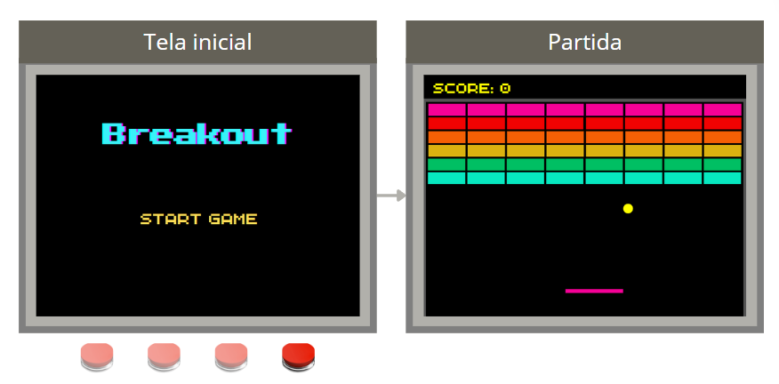

<strong>Transição da tela inicial para a partida</strong>

O campo de jogo possui os seguintes elementos: o valor do score atual exibido na parte superior esquerda; as linhas laterais e superior para delimitar a área que a bola pode percorrer; os blocos que devem ser destruídos, com cores variadas no decorrer das fileiras; a bola de jogo; e a barra inferior controlada pelo usuário. Caso o quarto botão da placa seja pressionado, a partida é pausada.

  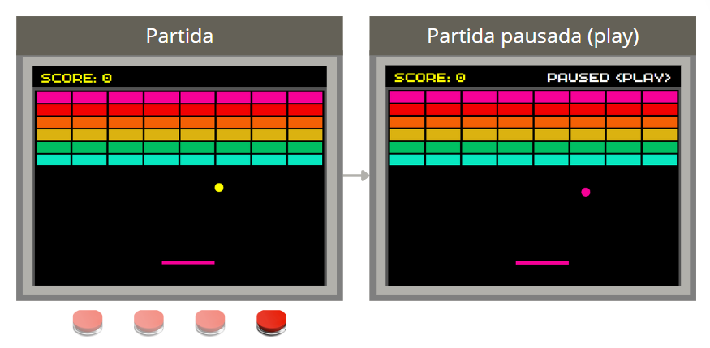

<strong>Transição da partida para a partida pausada</strong>

É indicado que a partida está pausada pela mensagem do canto superior direito e pela mudança da cor da bola. Além disso, também aparece ao lado a opção que o usuário pode escolher em seguida. Primeiramente aparece a opção de continuar o jogo, indicada pela palavra "play", e caso o quarto botão seja pressionado, é alterada para a opção de sair da partida, indicada pela palavra "exit". O quarto botão altera entre essas duas opções.

  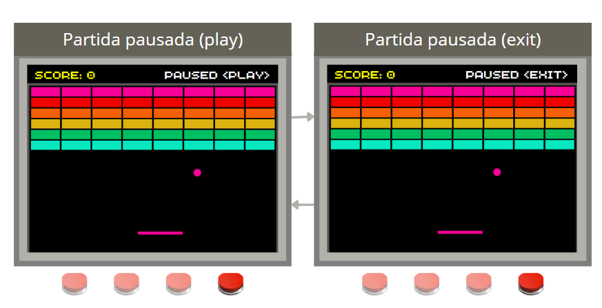

<strong>Transição da partida pausada com a opção de "play" para a opção de "exit", e vice-versa</strong>

Na tela de pause, o terceiro botão seleciona a opção atual, podendo sair da partida ou continuar o jogo. 

  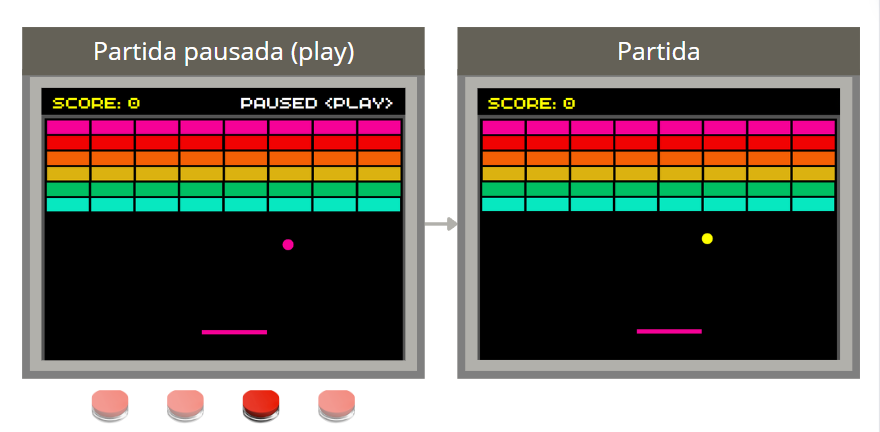

<strong>Transição da partida pausada na opção de "play" para o retorno da partida</strong>

  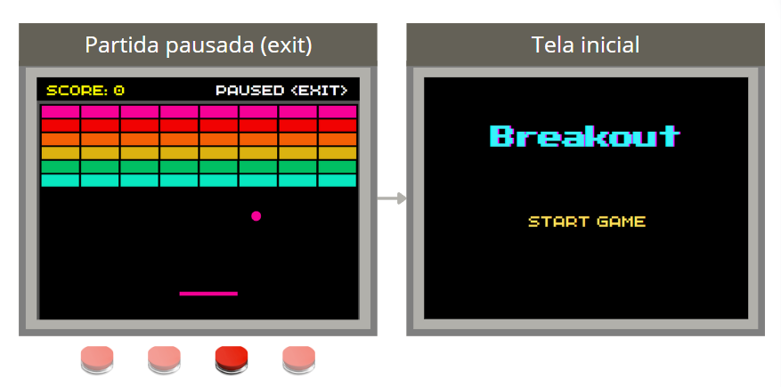

<strong>Transição da partida pausada na opção de "exit" para o retorno da tela inicial</strong>

Quando um bloco é destruído pela bola, ele não aparece mais na tela e sua respectiva pontuação é somada no score. 

  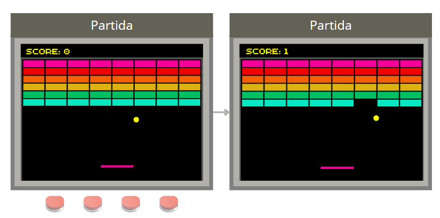

<strong>Ilustração da quebra de um bloco</strong>

Se a bola ultrapassar a altura da barra inferior, a partida é encerrada, assim, a tela de derrota é exibida com a frase "game over" e o score alcançado. 

  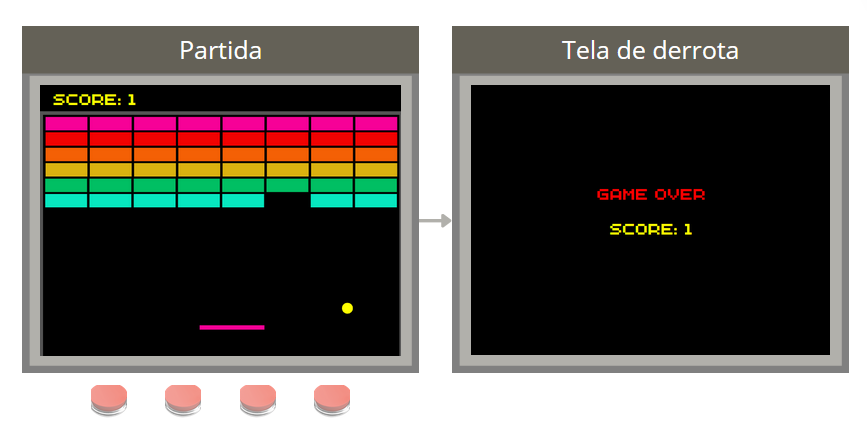

<strong>Transição da partida para tela de derrota</strong>

O uso do quarto botão faz a transição da tela de derrota para a tela inicial.

  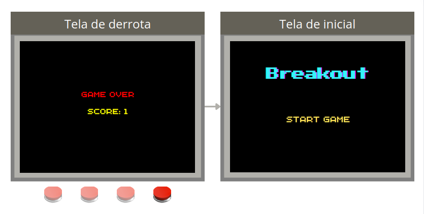

<strong>Transição da tela de derrota para a tela inicial</strong>

Caso todos os blocos sejam destruídos, a partida foi ganha. Na tela de vitória, é exibida a frase "you win" e dois foguetes sobem verticalmente.

  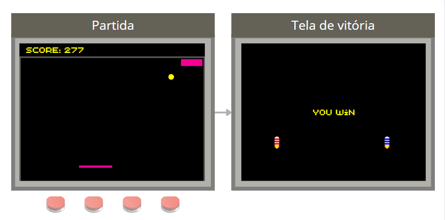

<strong>Transição da partida para tela de vitória</strong>

A tela de vitória possui uma animação contínua de fogos de artifício. Quando chegam em certa altura, os fogos explodem e exibem os traços das explosões. Os fogos continuam surgindo, um por um, enquanto o usuário estiver na tela de vitória.

  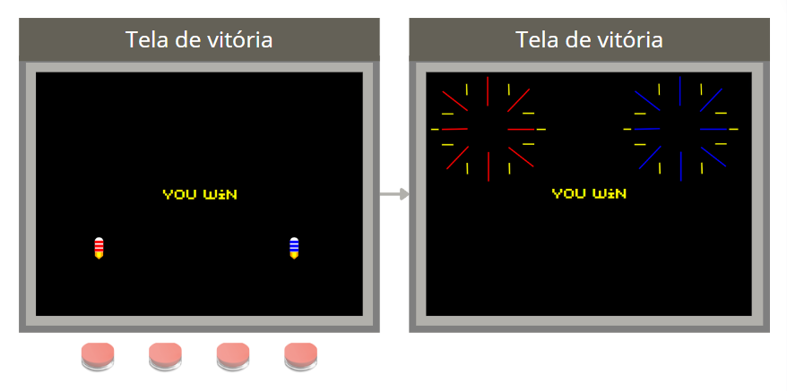

<strong>Início da animação de fogos</strong>

Caso o quarto botão seja pressionado, a tela de vitória é encerrada e o usuário volta a tela inicial.

  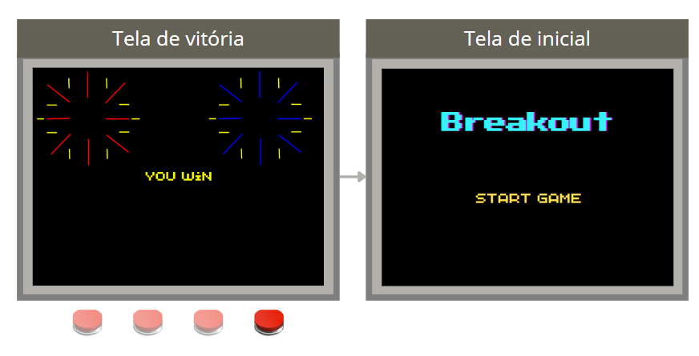

<strong>Transição da tela de vitória para a tela inicial</strong>

 
<h2> Dinâmica e Regras de Jogo </h2>

O objetivo principal do jogo Breakout é destruir todos os blocos que compõem a estrutura do cenário, utilizando uma bolinha. O jogador assume o controle de uma barra para rebater a bolinha e evitar que ela caia no "abismo", representado pela parte inferior da tela. Para garantir uma experiência dinâmica e desafiadora, o jogo conta com uma série de regras que serão apresentadas nesta seção.

<h3> Jogabilidade: Controle da Barra </h3>

A movimentação da placa é baseada na inclinação da placa DE1-SoC. O jogador deverá posicionar a placa em uma certa inclinação para a direita ou esquerda, o que resultará na movimentação da barra correspondente. Esse controle é realizado através do acelerômetro disponível na placa.

É importante ressaltar que a movimentação da barra está limitada pelas paredes laterais do cenário, ou seja, a barra não pode ultrapassar essas paredes durante o jogo.

Além disso, é crucial entender que a barra não possui uma velocidade fixa. Sua velocidade varia de acordo com o ângulo de inclinação da placa. Quanto maior o ângulo de inclinação, maior será a velocidade da barra, e vice-versa.

Os gifs a seguir ilustram a movimentação da placa e a consequente movimentação da barra de acordo com esses movimentos.

  

<strong> Movimento da barra a partir do movimento da placa</strong>

<h3> Características da Bola e sua Movimentação </h3>

A bola apresenta duas características principais: sua movimentação contínua e suas interações com as estruturas do cenário. Na física do jogo, a bolinha mantém um movimento incessante nos eixos horizontal (x) e vertical (y), exceto em casos específicos nos quais o botão de pausa é acionado.

Quando a bolinha colide com algum objeto no cenário, como paredes laterais, superior, blocos ou a barra controlada pelo jogador, ela é capaz de se refletir a partir do ponto de colisão. Essa reflexão pode ocorrer de três maneiras distintas: inversão de sentido apenas no eixo x, apenas no eixo y, ou simultaneamente nos dois eixos.

Analisando as diferentes colisões com cada objeto do cenário, temos as seguintes características:

<h4> Colisão com a Prancha </h4>

 Durante a colisão com a prancha, a bolinha pode refletir-se em três direções distintas, dependendo do ponto de impacto na prancha. A prancha é dividida em três partes: direita, esquerda e centro. Quando a bolinha atinge a parte direita da prancha, ela é refletida para a direita; quando atinge a parte esquerda, é refletida para a esquerda; e quando atinge o centro, ocorre uma reflexão perfeita.
 
 Além disso, após a colisão, tanto o ângulo quanto a velocidade da bolinha são alterados. Cada lado da prancha oferece quatro velocidades diferentes e ângulos distintos de reflexão, o que adiciona variedade e desafio ao jogo.

Para visualizar essas colisões, são disponibilizadas duas imagens anexas. A primeira imagem ilustra a mudança de direção da bolinha apenas no eixo y, alterando seu ângulo a partir do ponto de colisão. Já a segunda imagem mostra a inversão nos eixos x e y, proporcionando uma mudança significativa na trajetória da bolinha.

  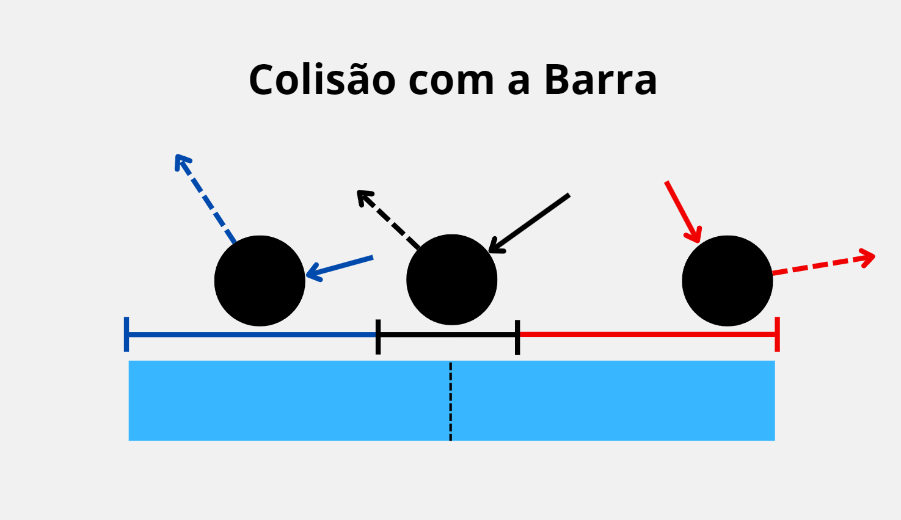

<strong> Bola colidindo nas 3 zonas da barra e tendo sua direção alterada no eixo y</strong>

  

<strong> Bola colidindo nas 3 zonas da barra e tendo sua direção alterada no eixo x e y</strong>

<h4> Colisão com as Paredes </h4>

Durante a colisão com as paredes, a bolinha experimenta uma reflexão perfeita a partir do ponto onde ocorreu a colisão. Em cada caso de colisão com a parede, as seguintes situações são observadas:

* **Colisão com Paredes Laterais:** Ao colidir com uma das paredes laterais, a bolinha conserva sua direção no eixo y e inverte o sentido no eixo x.

  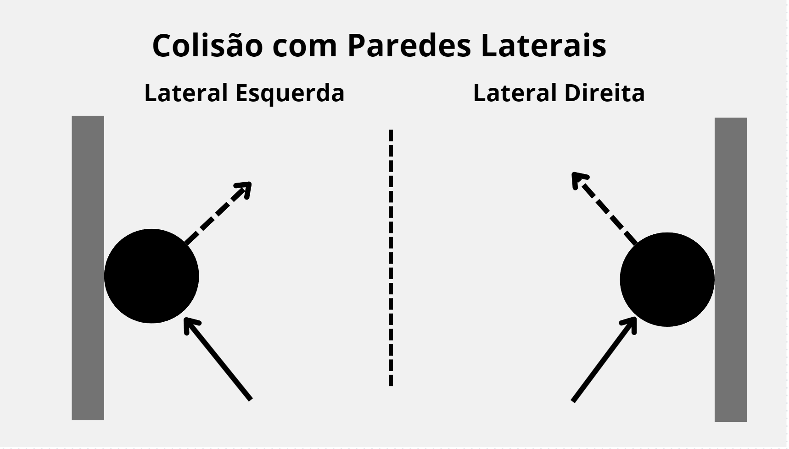

<strong> Bola colidindo com as paredes laterais direita e esquerda, e mudando sua trajetóia</strong>

* **Colisão com a Parede Superior:** Quando a bolinha colide com a parede superior, ocorre o oposto das paredes laterais: ela mantém sua direção no eixo x e inverte o sentido no eixo y.

  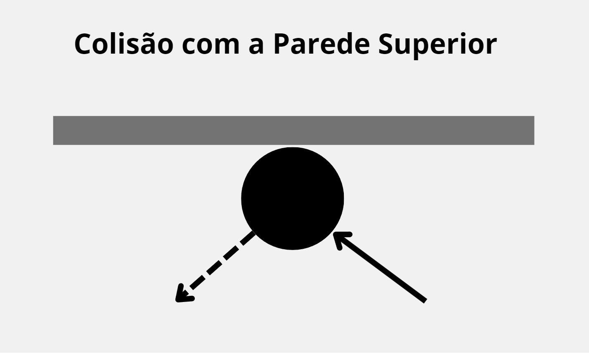

<strong> Bola colidindo com a paredes superior e mudando sua trajetóia</strong>

* **Colisão entre Paredes Superior e Lateral:** Se a bolinha colide entre a parede superior e lateral, ocorre a inversão nos dois eixos simultaneamente.

  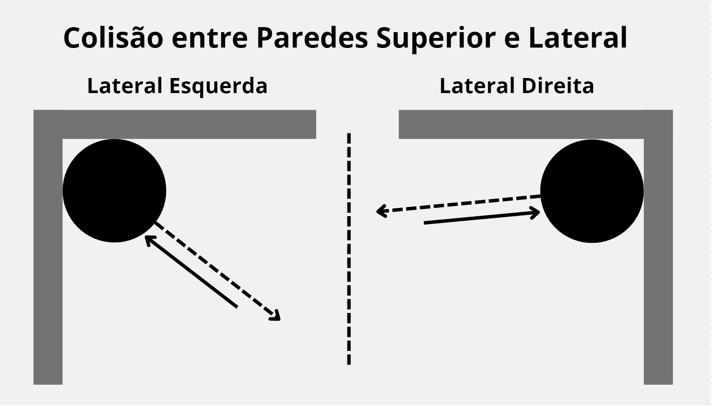

<strong> Bola colidindo com a paredes superior e lateral ao mesmo tempo, e mudando sua trajetóia</strong>

* **Colisão entre barra e Paredes Laterais:** Quando a bolinha colide entre a barra e uma das laterais, também ocorre a inversão nos dois eixos simultaneamente.

  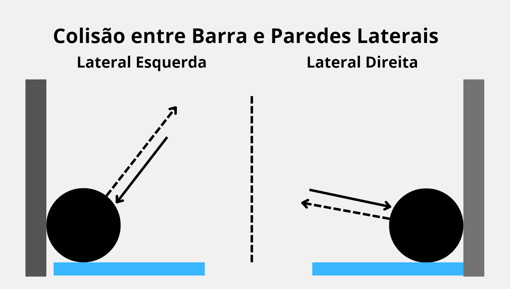

<strong> Bola colidindo com a parede lateral e a barra, e mudando sua trajetóia</strong>

<h4> Colisão com os blocos </h4>

 O último tipo de colisão é com os blocos. Se a colisão ocorre nas laterais, é invertido o eixo x; nas partes superior e inferior, é invertido o eixo y. Adicionalmente, há colisões específicas nas pontas dos blocos, onde o comportamento varia dependendo do movimento da bola (subindo ou descendo) e da presença de blocos adjacentes. Assim, segue algumas imagens para ilustrar essas colisões.

  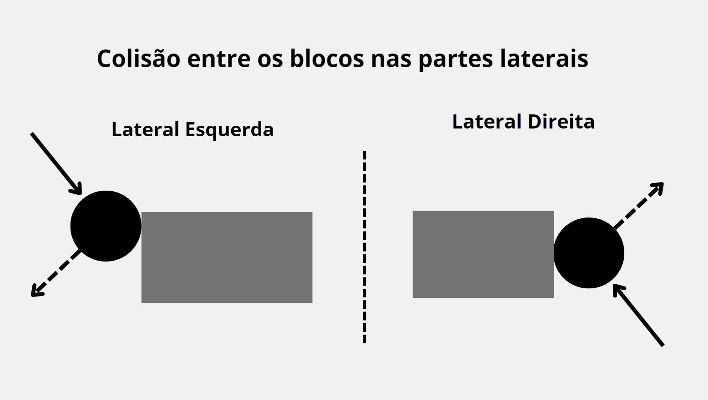

<strong> Bola colidindo com as partes laterais do bloco e mudando sua trajetóia</strong>

  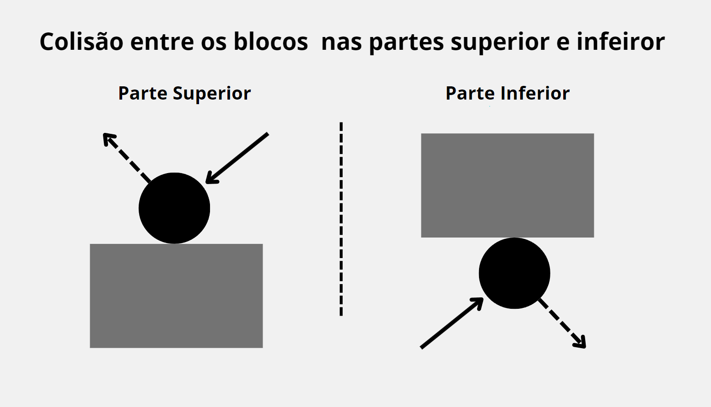

<strong> Bola colidindo com a parte superior e inferior do bloco, e mudando sua trajetóia</strong>

  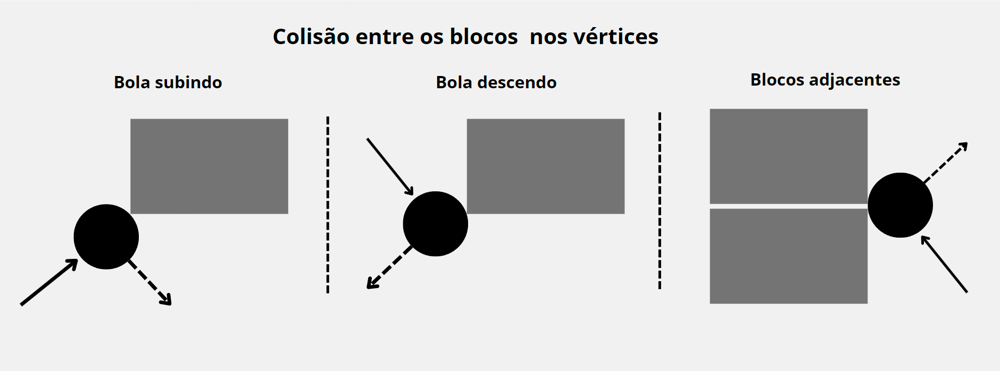

<strong> Bola colidindo com os vértices do bloco e mudando sua trajetória nas três possibilidades</strong>

<h3> Pontuação </h3>
O sistema de pontuação é baseado na quebra de blocos após cada colisão. Cada fileira de blocos possui um valor específico a ser pontuado. Os níveis mais baixos até os superiores possuem as seguintes pontuações progressivas: 1, 3, 5, 7, 9 e 11.

  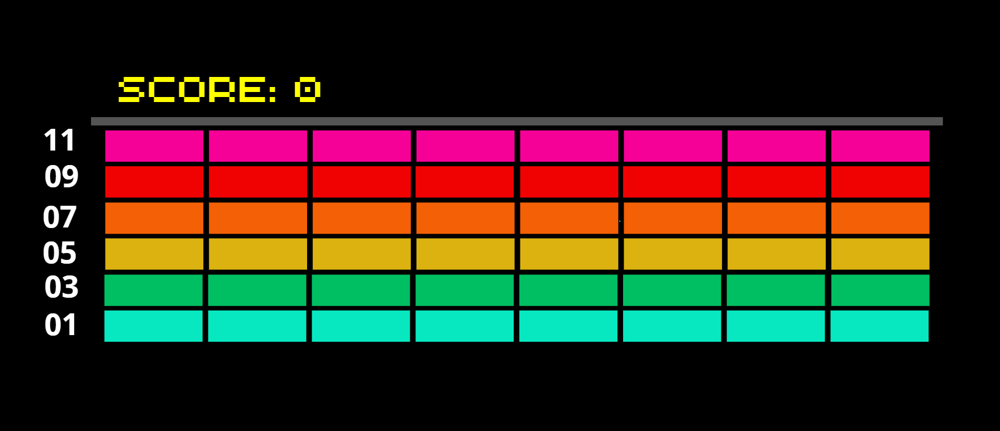

<strong> fileira de blocos e seus pontos </strong>

<h3> Finalização do Jogo </h3>
Existem duas condições de finalização do jogo: vitória ou derrota do jogador. A vitória é alcançada quando todos os blocos são quebrados durante a partida. Por outro lado, a derrota ocorre sempre que a bola ultrapassa o nível da barra, resultando em sua queda e encerramento do jogo.

  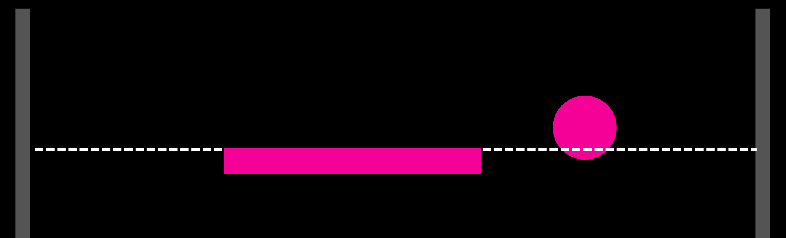

<strong> Bola ultrapassando a linha limite do jogo e perdendo o jogo</strong>

 
<h2> Algoritmos de Jogo </h2>

Para implementar as regras do jogo a nível de software, foram desenvolvidos diversos algoritmos responsáveis por gerenciar o comportamento dos elementos do jogo. Nesta seção, serão apresentadas as sequências responsáveis pela movimentação da bolinha e sua interação com os objetos do cenário.

<h3> Algoritmo de Colisão </h3>

Este algoritmo permite que a bolinha reconheça os objetos no cenário do jogo. Como todos os objetos têm formato retangular, exceto a bolinha, que é circular, foi desenvolvido um algoritmo clássico de detecção de colisão entre círculo e retângulo.

A lógica do algoritmo baseia-se em comparar um círculo com certo  raio ligeiramente maior (raio da bola mais o raio de colisão) e um retângulo de dimensões h e b Inicialmente, é procurado o ponto mais próximo entre o círculo e o retângulo, analisando as dimensões x e y. Esta análise permite considerar apenas os limites do retângulo.

Em seguida, é calculada a distância euclidiana entre a bola e o ponto de impacto utilizando o teorema de Pitágoras, e esse valor é arredondado, já que o jogo é em pixels. Se a distância calculada for menor ou igual ao raio da bola, significa que ocorreu uma colisão, e o algoritmo retorna 1. Caso contrário, retorna 0 para indicar que não houve colisão.

A imagem apresenta um fluxograma do algoritmo, proporcionando uma visão do seu funcionamento. Além disso, fornece uma representação cartesiana para uma compreensão visual mais abrangente.

  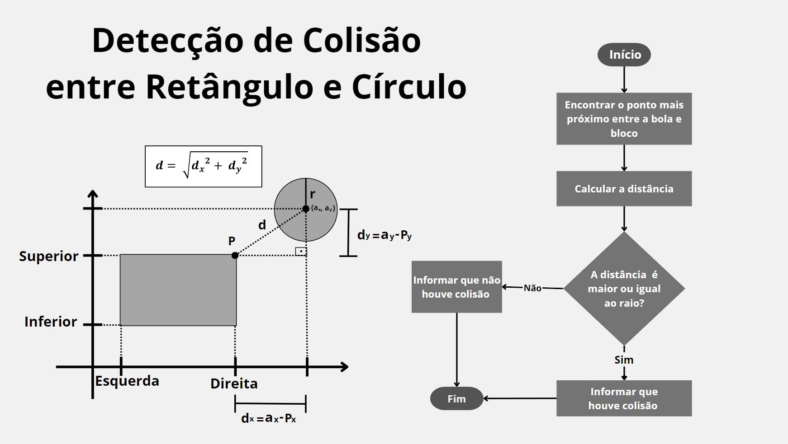

<strong> Fluxograma e visão cartesiana da detecção de colisão entre retângulo e círculo</strong>

<h3> Algoritmo de Verificação Contínua </h3>

Em simulações físicas, a verificação de colisões é um processo contínuo e crucial para garantir a precisão e a fidelidade da simulação. Enquanto a abordagem discreta atualiza a posição dos objetos em intervalos fixos de tempo, a verificação contínua de colisões é mais precisa, evitando problemas como o "efeito de túnel".

No contexto deste projeto, o algoritmo de verificação contínua de colisões é implementado para garantir que as colisões sejam detectadas entre cada intervalo de tempo, mesmo em movimentos rápidos ou objetos pequenos.

  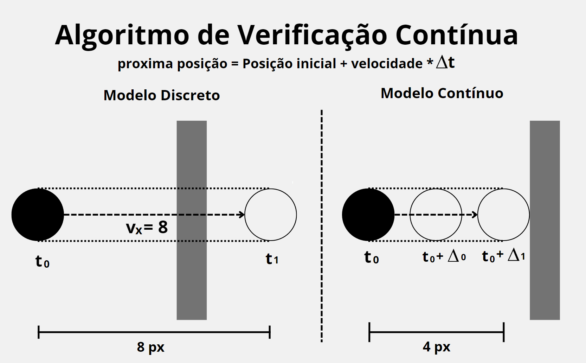

<strong> Modelo discreto e contínuo de verificação de colisão</strong>

O algoritmo de verificação contínua de colisões funciona da seguinte maneira: a partir de um número pré-definido de pontos intermediários entre a posição atual da bola e sua próxima posição, o algoritmo verifica se ocorrerá alguma colisão em cada ponto. Isso é feito ao calcular as coordenadas da bola em cada ponto intermediário e verificar se houve colisão com outros objetos do cenário.

Se uma colisão é detectada em algum ponto intermediário, a bola é movida para a posição onde ocorreu a colisão, e o tipo de colisão é informado para que a reflexão adequada seja realizada na próxima interação. Por outro lado, se nenhum ponto intermediário apresentar colisão, a bola realiza um movimento normal entre os quadros, sem nenhuma reflexão.

Segue uma versão simplificada para facilitar o entendimento do algoritmo: um gráfico de tempo e espaço que ilustra os testes realizados para 10 pontos intermediários em uma velocidade de 8 pixels por quadro, juntamente com uma versão do fluxograma do algoritmo.

  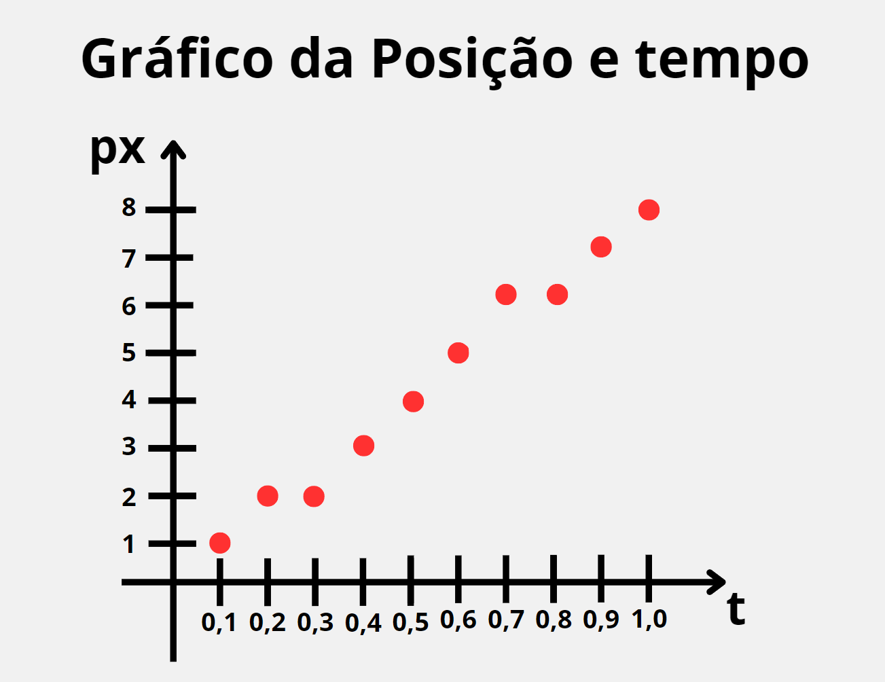

<strong> Modelo discreto e contínuo de verificação de colisão</strong>

  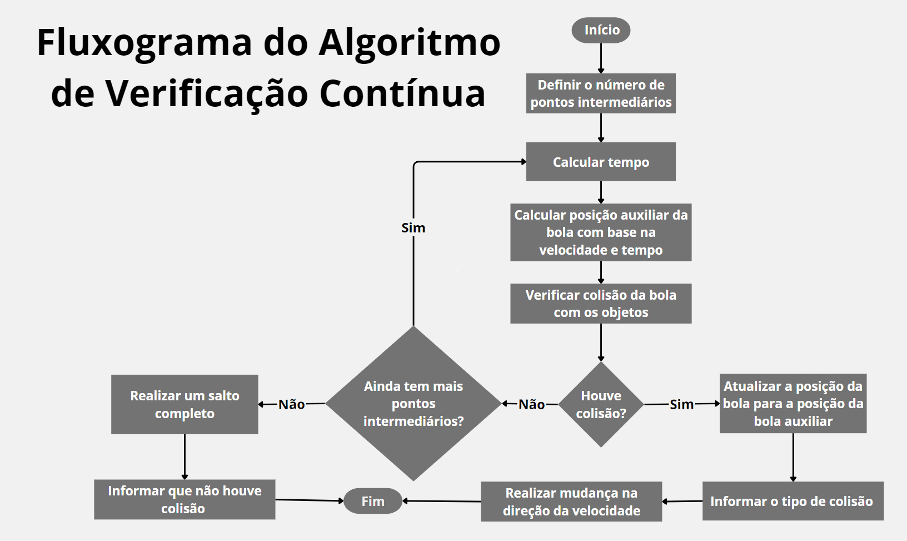

<strong> Fluxograma do algoritmo de verificação contínua de colisão</strong>

 
<h2> Solução Geral do projeto </h2>

A solução integral deste sistema demonstra sua capacidade completa de atender a todas as demandas requisitadas. Antes de entrar no loop principal do programa, os periféricos utilizados - VGA, acelerômetro e botões - são inicializados. Além disso, os elementos do jogo são iniciados, atribuindo suas características e posições iniciais. Por fim, a MEF (Máquina de Estados Finitos) da troca de telas é iniciada na tela de menu.

Dentro do loop principal, o sistema busca e exibe qual tela deve ser mostrada com base no estado atual. Após a exibição, o programa verifica se a tela atual é a do jogo. Se não for, verifica se algum botão foi pressionado para realizar a troca de cenário. Caso contrário, a execução retorna ao início do loop principal.

Se o jogo estiver em execução, o sistema lê o acelerômetro para verificar a movimentação da placa. Em seguida, move os objetos do jogo - bola e barra. A movimentação da barra é baseada nos dados do acelerômetro, enquanto a bola se move conforme o algoritmo de verificação contínua.

Após realizar todos os movimentos, o sistema analisa se a bola atingiu algum bloco e, se sim, remove esses blocos. Por fim, verifica se o jogo chegou ao fim. Se não, verifica se houve pressionamento de botão durante os passos anteriores e realiza a troca ou não de telas. Se o jogo terminar, os elementos do jogo são reorganizados para uma nova partida e a tela é alterada para a de vitória ou derrota. Em seguida, o loop principal é executado novamente.

Para uma compreensão mais clara da explicação, apresentamos abaixo um fluxograma detalhando o algoritmo utilizado na solução geral.

  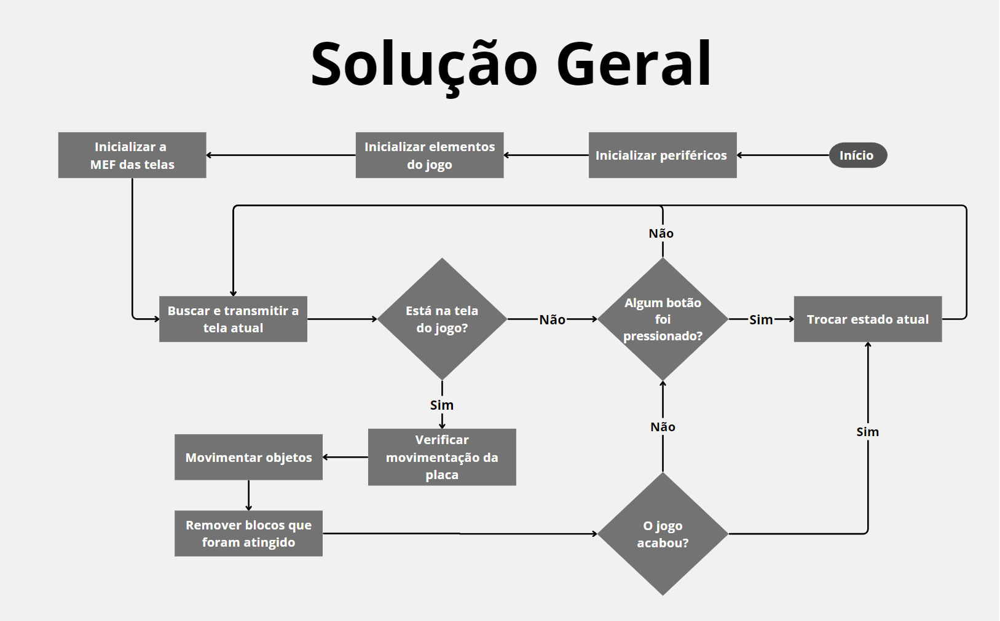

<strong> Fluxograma da solução geral do problema</strong>

 
<h2> Testes Realizados </h2>

* Transição da tela inicial para a partida.

  

<strong>Transição da tela inicial para a partida</strong>

* Colisão da bola com a parte do meio inferior de um bloco, e com a parte do meio da barra, preservando sua direção.

  

<strong>Colisão da bola com o meio inferior do bloco e com o meio da barra</strong>

* Colisão da bola com as paredes laterais e superior.

  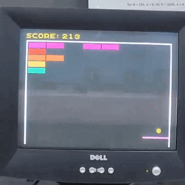

<strong>Colisão da bola com as paredes laterais e superior</strong>

* Colisão da bola com as diferentes partes da barra. Quanto mais a bola se aproxima da lateral, mais rápida será sua velocidade seguinte após a colisão. Colidir com o lado esquerdo direciona a bola para a esquerda, e com o lado direito, para a direita.

  

<strong>Mudança de velocidade e direção da bola dependendo do local que ela colide com a barra</strong>

* Colisão da bola com as laterais dos blocos.

  

<strong>Colisão da bola com as laterais dos blocos</strong>

* Colisão simultânea com dois blocos, na parte inferior e na lateral.

  

<strong>Colisão da bola com dois blocos simultaneamente</strong>

* Colisão da bola com a ponta do bloco.

  

<strong>Colisão da bola com a ponta do bloco</strong>

* Aparecimento da tela de derrota após a bola ultrapassar o limite inferior do campo de jogo. Transição da tela de derrota para a tela inicial.

  

<strong>Transição de tela na perda de jogo</strong>

* Pausando a partida e selecionando as opções de continuar e voltar para a tela inicial.

  

<strong>Opções do estado de pausa</strong>

* Animação da tela de vitória.

  

<strong>Animação da tela de vitória</strong>

 
<h2> Conclusão </h2>

A implementação do jogo inspirado no clássico Breakout, por meio do código em linguagem C no kit de desenvolvimento DE1-SoC, demonstrou ser uma experiência interativa e envolvente para os jogadores. Durante o processo de desenvolvimento, foram atendidos todos os requisitos estabelecidos, utilizando a arquitetura da placa e seus drivers como base sólida para a criação do jogo e implementação dos algoritmos necessários.

A interação harmoniosa entre o software e o hardware, possibilitada pela placa, permitiu a utilização integrada dos periféricos VGA, acelerômetro e botões, contribuindo para uma experiência de jogo mais imersiva. Os testes realizados evidenciaram a eficiência e confiabilidade do sistema, validando sua capacidade de operar de forma consistente em diversas condições de jogo.

Este projeto, além de alcançar seus objetivos iniciais, proporcionou um aprofundamento significativo dos conhecimentos em sistemas embarcados e arquitetura ARM. Ele capacitou os desenvolvedores a conciliar aspectos tanto de software quanto de hardware, estabelecendo uma base sólida para futuras explorações nas áreas de sistemas digitais e desenvolvimento de software.

 
<h2> Execução do Projeto  </h2>

Para iniciar o projeto, siga os passos abaixo para obter o código-fonte, compilar o código em C e executa-lo em um dispositivo FPGA DE1-SoC. 

**Passo 1: Clonar o Repositório**

Abra o terminal e execute o seguinte comando para obter o código do repositório:

    git clone https://github.com/Samara-Ferreira/PBL03-Breakout-Game.git

**Passo 2: Acessar o Diretório e Compilar o Código em C**

    cd PBL03-Breakout-Game\Modules

Compile e execute o código usando o comando:

    make all

 
<h2> Referências  </h2>

CAMACHO, Karla (2023). Breakout. Disponível em: https://pop.proddigital.com.br/consoles/breakout. Acessado em: 24 de fevereiro de 2024.

* Acelerômetro
  * https://docplayer.net/55053139-Using-the-accelerometer-on-de-soc-boards-1-introduction-for-quartus-prime-16-1.html

* Porta de saída de vídeo

* Botões

* Módulos de núcleo
  * https://fpgacademy.org/Downloads/DE1-SoC_Computer_ARM.pdf 